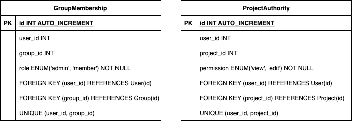

### 1. 프로젝트 소개
#### 1.1. 개발배경 및 필요성
학생들이 텀프로젝트나 비교과 활동을 통해 다양한 프로젝트를 개발하지만, 실제로 실행 가능한 형태로 결과물을 공유하는 경우는 드물다. 이러한 결과물의 배포가 이루어지지 않는 주요 원인은 상용 클라우드 서비스의 비용 부담과 배포 과정에서의 기술적인 어려움이다. 이로 인해 대부분의 학생들은 개발 환경에서 실행한 화면을 녹화하여 결과를 간접적으로 공유하는 방식을 선택하고 있다.

#### 1.2. 개발 목표 및 주요 내용
서버리스 프로젝트 배포 시스템을 개발하여 학생들이 비용이나 기술적 장벽 없이 자유롭게 자신의 프로젝트를 배포하고 공유할 수 있도록 하는 것을 지원하고자 한다.

#### 1.3. 세부내용
프로젝트를 배포 템플릿을 활용해 컨테이너로 쉽게 배포할 수 있도록 하고 지속적인 운영이 가능하도록 지원한다. 이를 통해 학생들은 자신의 프로젝트를 배포하여 실행 가능한 형태로 공유함으로써 실제 피드백을 받아볼 수 있고 포트폴리오로도 활용할 수 있다.

#### 1.4. 기존 서비스 대비 차별성
이 서버리스 프로젝트 배포 시스템은 교육 환경에 최적화된 설계를 통해 학생들의 학습과 성장을 중심에 둔다. 프로젝트의 지속적인 운영을 지원하여 학생들이 장기적으로 작업을 관리하고 개선할 수 있게 하며, 이는 실무 경험을 쌓는 데 도움이 된다. 또한, 배포된 프로젝트를 효과적인 포트폴리오로 활용할 수 있어 학생들의 경력 개발에 기여한다. 더불어 각 학교의 특정 요구사항과 정책에 맞춤화될 수 있어, 학교 환경에 더욱 적합한 서비스를 제공하며 학생들의 프로젝트 개발과 공유를 효과적으로 지원한다.

### 2. 상세설계
#### 2.1. 시스템 구성도


#### 2.2. 사용 기술
<div align="center">


</div>

#### 2.3. 세부 구성
#### 백엔드 아키텍처 설계
전체적인 구성도는 다음과 같으며, 백엔드 컴포넌트의 구성요소는 WAS(Web Application Server), In Memory Cache, RDBMS로 구성되어 있으며, 각각 Tomcat, Redis, PostgreSQL을 사용한다.


각각의 구성요소들은 도커라이징(Dockerizing)된 컨테이너들로 구성되어 있으며, Docker에서 지원하는 내부 네트워크를 통해 도메인 네임으로 서로 통신한다.
또한 인프라 자원 및 컴포넌트와는 메시지큐를 통해 비동기적으로 데이터를 주고받는다.

각각 구성요소들의 세부 역할은 다음과 같다.

| 구성요소 | 역할 |
|---------|-----|
| Tomcat(WAS) | - Spring Security를 이용한 인증/인가 처리<br>- RESTful API Endpoint 제공<br>- Spring Data JPA를 이용한 데이터 접근 처리 |
| Redis(Cache) | - Cacheable 데이터(ex. 회원가입 시 이메일 인증 코드) 저장<br>- 빠른 데이터 접근을 위한 인메모리 캐싱 |
| PostgreSQL(DB) | - 영구적 데이터 저장 및 관리<br>- 트랜잭션 처리 및 데이터 무결성 보장 |
| Docker | - 어플리케이션 및 의존성 컨테이너화<br>- 인프라 구성요소와의 환경 일관성 유지 |


#### 데이터베이스 설계
데이터베이스는 개념적 설계를 우선적으로 진행하고, 논리적 설계를 진행하였다.

**[개념적 설계]**


주요 엔티티에는 User(사용자), Group(사용자가 생성하는 그룹), Project(그룹에 배포하는 프로젝트), 이외 권한 처리를 위한 GroupMembership과, ProjectAuthority가 있다.

각 구성 요소에 대한 세부 내용은 다음과 같다.

| 구성요소 | 설명 | 주요 필드 |
|---------|-----|----------|
| User | 시스템 사용자 | email, password, name |
| Group | 시스템 사용자의 집합, 사용자가 생성 | name |
| Project | 그룹 내에서 배포되는 프로젝트 | name, subdomain |
| GroupMembership | 그룹 내 멤버 정보 및 멤버들의 역할 | id(user), role |
| ProjectAuthority | 프로젝트를 보거나 편집할 수 있는 권한 | permission |


각 구성 요소 간 관계는 다음과 같이 설정하였다.

| 테이블 | User, Group, Project, GroupMemberShip, ProjectAuthority |
|-------|---------------------------------------------------|
| 관계 설정 | 한 사용자는 여러 그룹을 가진다.(1:N)<br>한 그룹은 여러 사용자를 가진다.(1:N)<br>한 그룹은 여러 프로젝트를 가진다.(1:N)<br>한 그룹은 여러 그룹 멤버십을 가진다.(1:N)<br>한 프로젝트는 여러 프로젝트 권한을 가진다.(1:N)<br>한 사용자는 여러 프로젝트 권한을 가진다.(1:N) |


**[논리적 설계]**
- 주요 엔티티 설계

  

- 권한 처리와 연관된 엔티티 설계

  
  
- 부가적 엔티티 설계

  

### Spring Security 필터 체인 흐름 구현

백엔드 핵심 구성요소 중 하나인 RESTful API에 세밀한 접근 제어와 권한관리를 위해 Spring Security 필터 체인을 아래 그림과 같이 구성하였다.

  

세부 인증/인가 동작과정은 다음과 같다.

**[인증 과정]**

1. CORS(Cross Origin Resource Sharing)처리
   클라이언트 요청이 들어오면 CORS Filter가 작동하며, 설정된 CORS 정책에 따라 요청의 출처를 검사하고, 허용 여부를 검사한다.

2. JWT 토큰 검증
   JWT Token Validator Filter가 요청 헤더에서 JWT 토큰을 추출하고 이의 디지털 	서명 및 만료시간을 검증한다. 유효한 토큰이면 인증된 것으로 간주하고 다음 단계	로 진행한다.

3. 사용자 이메일/비밀번호 인증
   JWT Token이 없거나, 유효하지 않은 경우, Basic Authentication Filter가 동작한다. 이는 Spring Security에서 제공하는 권한 제공자인 Authentication Manager를 상속한 CustomEmailPasswordAuthenticationProvider를 호출하여 인증을 처리한다. 이 Provider는 회원관련 DAO인)ata Access ObjectD( MemberRepository를 사용하여 사용자 정보를 조회하고, PasswordEncoder Bean을 사용하여 제공된 비밀번호와 저장된 비밀번호를 비교한다. 

**[인가 과정]**

1. 요청 경로 검사
   Authorization Filter가 요청된 리소스의 URL을 검사한다.

2. 접근 권한 확인
   지정된 API 엔드포인트에 따라 접근권한을 확인한다.

3. 리소스 접근 허용/거부
   인증된 사용자이고, 해당 리소스에 대한 접근 한권이 있으면 요청을 허용한다. 그렇지 않은 경우, 요청을 거부하고 적절한 오류 응답을 반환한다.

### 3. 개발결과
#### 3.1. 전체시스템 흐름도


#### 3.2. 기능설명
| 페이지         | 기능 설명                                                                                                          |
|----------------|--------------------------------------------------------------------------------------------------------------------|
| 회원가입 페이지 | - 사용자 이름과 이메일을 입력하여 회원가입을 한다.<br>- 이메일은 이메일 형식으로 입력한다.                               |
| 로그인 페이지   | - 이메일과 비밀번호로 로그인한다.                                                                                      |
| 메인 페이지     | - 다른 그룹들의 프로젝트를 갤러리 형식으로 탐색한다.<br>- 좋아요순/조회순으로 정렬할 수 있다.<br>- 프로젝트명, 그룹명, 참가자명으로 검색할 수 있다. |
| 사이드바        | - 사용자가 속한 그룹 목록을 확인한다.<br>- 각 그룹을 클릭하면 해당 그룹에 속한 프로젝트들이 펼쳐져 표시된다.<br>- 각 프로젝트를 클릭하면 해당 프로젝트 페이지로 이동한다. |
| 프로젝트 페이지 | - 배포된 프로젝트의 URL을 제공한다.<br>- 버튼을 누르면 바로 이동할 수 있다.<br>- 프로젝트명, 사진, 개요, 설명, 프로젝트 참가자 목록을 확인할 수 있다.<br>- 댓글을 작성할 수 있다.<br>- 좋아요 버튼을 통해 프로젝트에 반응할 수 있다. |
| 배포 페이지     | - 프로젝트명, 개요, 설명, 참여자를 수정한다.                                                                          |
| 그룹 페이지     | - 그룹명, 소개, 그룹의 참여자, 결제수단, 프로젝트들을 확인할 수 있다.<br>- 그룹의 권한은 어드민과 멤버로 나뉜다.<br>- 그룹의 어드민일 경우, 그룹명과 그룹 소개를 수정한다.<br>- 참여자를 추가 및 삭제한다.<br>- 참여자 권한을 어드민 혹은 멤버로 변경한다.<br>- 결제 수단을 추가 및 삭제한다.<br>- 프로젝트를 추가할 수 있다.<br>- 그룹의 멤버일 경우, 그룹명, 소개, 그룹의 참여자, 프로젝트들을 확인할 수 있다. |
| 마이페이지       | - 프로필 사진, 자기소개, 참여한 그룹과 프로젝트를 확인할 수 있다.<br>- 본인의 마이페이지일 경우, 프로필 사진과 자기소개를 수정할 수 있다. |

#### 3.3. 기능 명세

#### 3.4. 디렉토리 구조
- `Front End`
```
PICKLE-FRONT/
├── src/
│   ├── api/
│   ├── assets/
│   ├── components/
│   │   ├── Buttons/
│   │   ├── Input/
│   │   ├── Navigation/
│   │   └── Layout/
│   │       ├── Container/
│   │       ├── Sidebar/
│   │       ├── Header/
│   │       ├── Footer/
│   │       └── MainLayout.jsx
│   ├── constants/
│   │   ├── muiTheme.js
│   │   └── pickleTheme.js
│   ├── pages/
│   │   ├── Home/
│   │   ├── Project/
│   │   ├── Deploy/
│   │   ├── Group/
│   │   ├── Login/
│   │   ├── Signup/
│   │   └── Mypage/
│   └── router/
│       └── useMainRouter.jsx
├── public/
│   ├── index.html
│   └── favicon.ico
├── .eslintrc.json
├── .prettierrc
├── postcss.config.js
├── jsconfig.json
├── .gitignore
├── tailwind.config.js
├── webpack.config.js
├── README.md
└── package.json

```
- `Back End`
```
├── PickleApplication.java
├── auth
│   ├── api
│   ├── dto
│   ├── exception
│   └── service
├── global
│   ├── GlobalExceptionHandler.java
│   ├── configuration
│   ├── constants
│   ├── response
│   ├── security
│   └── utils
├── group
│   ├── api
│   ├── dao
│   ├── dto
│   ├── entity
│   ├── exception
│   ├── service
│   └── utils
├── invitation
│   └── entity
├── project
│   ├── api
│   ├── dao
│   ├── entity
│   └── service
└── user
    ├── api
    ├── dao
    ├── dto
    ├── entity
    └── service
```

### 4. 설치 및 사용 방법
> 제품을 설치하기 위헤 필요한 소프트웨어 및 설치 방법을 작성하세요.
>
> 제품을 설치하고 난 후, 실행 할 수 있는 방법을 작성하세요.

### 5. 소개 및 시연 영상
> 프로젝트에 대한 소개와 시연 영상을 넣으세요.
> 프로젝트 소개 동영상을 교육원 메일(swedu@pusan.ac.kr)로 제출 이후 센터에서 부여받은 youtube URL주소를 넣으세요.

### 6. 팀 소개
> 팀원 소개 & 구성원 별 역할 분담 & 간단한 연락처를 작성하세요.

### 7. 해커톤 참여 후기
> 팀원 별 해커톤 참여 후기를 작성하세요.
<br/>

