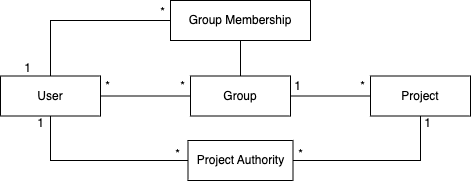
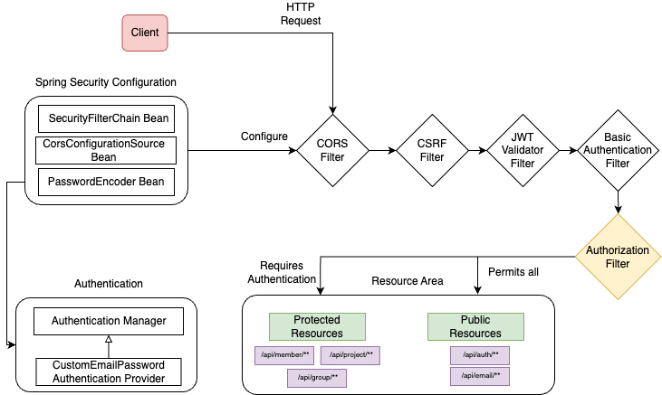

## 세부 구성
### 백엔드 아키텍처 설계
전체적인 구성도는 다음과 같으며, 백엔드 컴포넌트의 구성요소는 WAS(Web Application Server), In Memory Cache, RDBMS로 구성되어 있으며, 각각 Tomcat, Redis, PostgreSQL을 사용한다.

각각의 구성요소들은 도커라이징(Dockerizing)된 컨테이너들로 구성되어 있으며, Docker에서 지원하는 내부 네트워크를 통해 도메인 네임으로 서로 통신한다.
또한 인프라 자원 및 컴포넌트와는 메시지큐를 통해 비동기적으로 데이터를 주고받는다.

각각 구성요소들의 세부 역할은 다음과 같다.

| 구성요소 | 역할 |
|---------|-----|
| Tomcat(WAS) | - Spring Security를 이용한 인증/인가 처리 - RESTful API Endpoint 제공 - Spring Data JPA를 이용한 데이터 접근 처리 |
| Redis(Cache) | - Cacheable 데이터(ex. 회원가입 시 이메일 인증 코드) 저장 - 빠른 데이터 접근을 위한 인메모리 캐싱 |
| PostgreSQL(DB) | - 영구적 데이터 저장 및 관리 - 트랜잭션 처리 및 데이터 무결성 보장 |
| Docker | - 어플리케이션 및 의존성 컨테이너화 - 인프라 구성요소와의 환경 일관성 유지 |

### 데이터베이스 설계
데이터베이스는 개념적 설계를 우선적으로 진행하고, 논리적 설계를 진행하였다.

**[개념적 설계]**

주요 엔티티에는 User(사용자), Group(사용자가 생성하는 그룹), Project(그룹에 배포하는 프로젝트), 이외 권한 처리를 위한 GroupMembership과, ProjectAuthority가 있다.

각 구성 요소에 대한 세부 내용은 다음과 같다.

| 구성요소 | 설명 | 주요 필드 |
|---------|-----|----------|
| User | 시스템 사용자 | email, password, name |
| Group | 시스템 사용자의 집합, 사용자가 생성 | name |
| Project | 그룹 내에서 배포되는 프로젝트 | name, subdomain |
| GroupMembership | 그룹 내 멤버 정보 및 멤버들의 역할 | id(user), role |
| ProjectAuthority | 프로젝트를 보거나 편집할 수 있는 권한 | permission |

각 구성 요소 간 관계는 다음과 같이 설정하였다.

| 테이블 | User, Group, Project, GroupMemberShip, ProjectAuthority |
|-------|---------------------------------------------------|
| 관계 설정 | 한 사용자는 여러 그룹을 가진다.(1:N) 한 그룹은 여러 사용자를 가진다.(1:N) 한 그룹은 여러 프로젝트를 가진다.(1:N) 한 그룹은 여러 그룹 멤버십을 가진다.(1:N) 한 프로젝트는 여러 프로젝트 권한을 가진다.(1:N) 한 사용자는 여러 프로젝트 권한을 가진다.(1:N) |

**[논리적 설계]**
- 주요 엔티티 설계

  

- 권한 처리와 연관된 엔티티 설계

  
  
- 부가적 엔티티 설계

  

### Spring Security 필터 체인 흐름 구현

백엔드 핵심 구성요소 중 하나인 RESTful API에 세밀한 접근 제어와 권한관리를 위해 Spring Security 필터 체인을 아래 그림과 같이 구성하였다.

  

세부 인증/인가 동작과정은 다음과 같다.

**[인증 과정]**

1. CORS(Cross Origin Resource Sharing)처리
   클라이언트 요청이 들어오면 CORS Filter가 작동하며, 설정된 CORS 정책에 따라 요청의 출처를 검사하고, 허용 여부를 검사한다.

2. JWT 토큰 검증
   JWT Token Validator Filter가 요청 헤더에서 JWT 토큰을 추출하고 이의 디지털 	서명 및 만료시간을 검증한다. 유효한 토큰이면 인증된 것으로 간주하고 다음 단계	로 진행한다.

3. 사용자 이메일/비밀번호 인증
   JWT Token이 없거나, 유효하지 않은 경우, Basic Authentication Filter가 동작한다. 이는 Spring Security에서 제공하는 권한 제공자인 Authentication Manager를 상속한 CustomEmailPasswordAuthenticationProvider를 호출하여 인증을 처리한다. 이 Provider는 회원관련 DAO인)ata Access ObjectD( MemberRepository를 사용하여 사용자 정보를 조회하고, PasswordEncoder Bean을 사용하여 제공된 비밀번호와 저장된 비밀번호를 비교한다. 

**[인가 과정]**

1. 요청 경로 검사
   Authorization Filter가 요청된 리소스의 URL을 검사한다.

2. 접근 권한 확인
   지정된 API 엔드포인트에 따라 접근권한을 확인한다.

3. 리소스 접근 허용/거부
   인증된 사용자이고, 해당 리소스에 대한 접근 한권이 있으면 요청을 허용한다. 그렇지 않은 경우, 요청을 거부하고 적절한 오류 응답을 반환한다.
